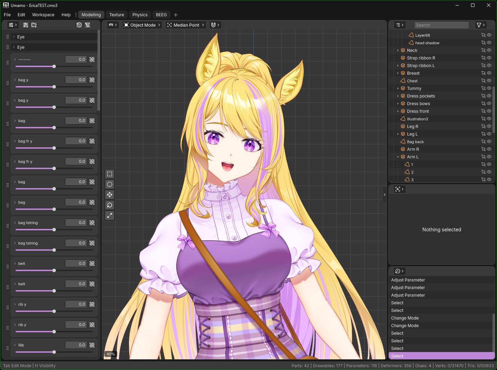

# Umamo

An open-source cross-platform modelling editor for 2D puppet animation, with first class pen and touch support, designed to interoperate with the Live2D Cubism source format (`.cmo3`).  Runs on Windows, macOS, Linux, and Android tablets with pen/touch input.  Supports importing and exporting both CMO3 and MOC3 formats.

> **Status:** Early development.  Prebuilt downloads are on the [Releases page](https://github.com/umamoorg/umamo/releases).  Note, releases are not currently signed so Windows and MacOS will complain about it.  APIs, formats, and scope are in flux.



## Quick Notes

**Q:** Can I support the Umamo project financially?

**A:** Umamo is completely open source and free, but if you would like to support the project you can [join the Patreon](https://patreon.com/Azxiana) or make a one time [donation through Ko-Fi](https://ko-fi.com/azxiana).  All received funds go directly to paying hosting bills, hardware for testing, and platform developer fees.  Excess funds will be banked for the future or distributed to other open source projects working with the Umamo Project.

---

**Q:** Does Umamo do animations yet?

**A:** Not yet.  This is a long term stretch goal.  Getting the modeling, UV editor, and physics interface perfected first will be important for animation later.

---

**Q:** Umamo doesn't support a newer version of Cubism/Krita/Clip Studio Paint file formats yet.  Can you add support?

**A:** Yes, please [search if the issue has already been reported](https://github.com/umamoorg/umamo/issues) and if not, [open a new issue](https://github.com/umamoorg/umamo/issues/new) that describes the problem.

---

**Q:** Umamo corrupted my project and I lost my work!  HELP!

**A:** Currently Umamo is alpha level software available for testing.  Please make sure to **make regular backups** of your files.  In fact, make second copies of your files explicitly for playing around with.  Do not use the original copies.

## Downloads

Every tagged version publishes desktop builds on the [Releases page](https://github.com/umamoorg/umamo/releases).  There are two different releases per platform:

| File                                      | Note                                                                                                                                     |
| ----------------------------------------- | ---------------------------------------------------------------------------------------------------------------------------------------- |
| `umamo-<target>-<version>.zip`/`.tar.gz`  | Java SDK not required, just run it directly.                                                                                             |
| `umamo-<target>-<version>.jar`            | You will need Java SDK 21 or higher to run.  Either open through the file browser or through the command line.  `java -jar umamo-...jar` |

Targets: `linux-x64`, `linux-arm64`, `windows-x64`, `macos-arm64`, `macos-x64`.  Check your download against the release's `SHA256SUMS.txt`.

**These builds are not signed.**  Code signing and notarization cost a lot of money so I will be waiting to do that until getting to a release candidate stage.  Until then Windows and MacOS will complain about the applications being unsigned.

- **MacOS:** Gatekeeper will quarantine the application and report it as *damaged*.  It is not damaged.  After unzipping run this in the Terminal, `xattr -dr com.apple.quarantine /path/to/umamo.app`, or allow the application through the settings.
- **Windows:** SmartScreen shows "Windows protected your PC".  Choose *More info* -> *Run anyway*.
- **Linux:** Just run the application: `tar xzf umamo-*.tar.gz` and run `umamo/bin/umamo`.  Linux doesn't restrict you from running any application that you wish to run on your computer.

## Building & Development

Umamo is a Kotlin Multiplatform project (Gradle, Kotlin DSL) targeting desktop and Android from one shared codebase.

| Platform | Note                                                                                                |
| -------- | --------------------------------------------------------------------------------------------------- |
| Windows  | Regularly built and tested                                                                          |
| Linux    | Regularly built and tested                                                                          |
| MacOS    | Working, minimally tested.                                                                          |
| Android  | Not yet, incomplete graphics layer implementation is blocking it.                                   |
| iPadOS   | Application and UI loads, but there is no puppet renderer and JDOM is incompatible.                 |

### Prerequisites

- **JDK 21** (LTS). The build is pinned to a 21 toolchain.  Point `JAVA_HOME` at a JDK 21 — e.g. `export JAVA_HOME=/usr/lib/jvm/java-21-openjdk-amd64`. (Newer JDKs run Gradle fine, but are ahead of the Android toolchain.)  Use a distribution JDK, not Homebrew's: `:desktop:createDistributable` runs Compose's `checkRuntime`, which hard-errors on a Homebrew JDK unless you pass `-Pcompose.desktop.packaging.checkJdkVendor=false`.
- **Android SDK** with `platforms;android-36` and `build-tools;36.0.0`. Set `ANDROID_HOME` (or create `local.properties` with `sdk.dir=…`). Only needed for the Android target.

The Gradle wrapper (`./gradlew`) pins the Gradle version so no system Gradle install required.

### Common commands

```bash
./gradlew :desktop:run                                      #Launch the desktop editor
./gradlew :android:installDebug                             #Deploy to a connected Android tablet
./gradlew build                                             #Everything
./gradlew test                                              #Unit tests
./gradlew ktlintFormat                                      #Format all files according to .editorconfig
./gradlew -q :cli:run --args="dump model.moc3"              #Dump a CMO3/MOC3's contents to stdout
./gradlew -q :cli:run --args="convert model.cmo3 out.moc3"  #Convert between formats(Overwrites WITHOUT confirmation)
./gradlew -q :cli:run --args="diff a.cmo3 b.moc3"           #Compare two models semantically
# Cross-target the desktop build (default: host). -Pumamo.target swaps the bundled Skiko + LWJGL
# natives: linux-x64 | linux-arm64 | windows-x64 | macos-x64 | macos-arm64.
./gradlew :desktop:packageUberJarForCurrentOS -Pumamo.target=windows-x64
# Self-contained app image with a bundled JRE (what the release workflow ships).
# → app/desktop/build/compose/binaries/main/app/
./gradlew :desktop:createDistributable
```

`-Pumamo.target` is meaningless for `createDistributable` and must not be combined with it: an app image jlinks the *host* JDK into itself, so cross-resolving the natives would bundle one platform's Skiko/LWJGL inside another platform's runtime.  Only the uber jar is portable that way.  Pass `-Pumamo.requireTargetIsHost=true` (as CI does) to turn a mismatch into a build failure.

### Running on WSL2 (WSLg)

Two things differ from a native Linux box (neither applies on a real desktop/GPU):

- **Use the system JDK 21, not Homebrew's.** Homebrew's `openjdk@21` has a few issues resolving libraries so it is easier to use the system installed JDK.  Install `sudo apt install openjdk-21-jdk` and point `JAVA_HOME` at it: `export JAVA_HOME=/usr/lib/jvm/java-21-openjdk-amd64`.
- **Opt into the GPU.** Mesa defaults to the `llvmpipe` software rasteriser on WSL; select the hardware D3D12 path explicitly.  Compose's own Skiko renderer can't make a hardware GL context under WSLg, so let it fall back to software.

```bash
MESA_LOADER_DRIVER_OVERRIDE=d3d12 GALLIUM_DRIVER=d3d12 SKIKO_RENDER_API=SOFTWARE \
  ./gradlew :desktop:run
```

### Cross-building for another platform

By default the desktop build bundles the natives for the machine running it.  Pass `-Pumamo.target=<os>-<arch>` to bundle a *different* platform's natives instead which is useful for testing a Windows build from a WSL2/Linux checkout.  Recognized targets: `linux-x64`, `linux-arm64`, `windows-x64`, `macos-x64`, `macos-arm64`.

```bash
# Produce a Windows-native runnable uber-jar from WSL2/Linux:
./gradlew :desktop:packageUberJarForCurrentOS -Pumamo.target=windows-x64
# → app/desktop/build/compose/jars/
```

This swaps both the Compose/Skiko renderer native and the LWJGL GL natives so the jar runs on the target.  It is **not** a cross-compiler: the result is portable JVM bytecode plus the target's natives, so you still need a **matching JVM on the target** to launch it.

Don't combine `-Pumamo.target` with `:desktop:run` — that would load the target's natives in your host JVM and fail.  The override is for producing artifacts and not running locally.

### Module layout

Reusable library modules live under `module/`, runnable application targets under `app/`.  Everything else at the repo root (`gradle/`, `docs/`, build files) is intentionally *not* a module. A module's Gradle path (`:format`) is kept flat and independent of its folder.  See: [settings.gradle.kts](settings.gradle.kts)

| Module      | Directory         | Targets       | Role                                                                                                   |
| ----------- | ----------------- | ------------- | ------------------------------------------------------------------------------------------------------ |
| `:format`   | `module/format`   | jvm + android | Cubism file family + art I/O (CMO3 read/write, …)                                                      |
| `:reimport` | `module/reimport` | jvm + android | Source-art binding + non-destructive reconcile                                                         |
| `:storage`  | `module/storage`  | jvm + android | App config/data dirs + file IO (okio) + native file dialogs (FileKit)                                  |
| `:settings` | `module/settings` | jvm + android | JSON settings: defaults←user merge, dotted get/set, change Flow → `:storage`                           |
| `:runtime`  | `module/runtime`  | jvm + android | Puppet model + CMO3 ingest                                                                             |
| `:render`   | `module/render`   | jvm + android | Deformation eval (CPU) + renderer + morph-blend shaders (`expect`/`actual`: LWJGL / GLES) → `:runtime` |
| `:ui`       | `module/ui`       | jvm + android | Compose Multiplatform editor shell                                                                     |
| `:desktop`  | `app/desktop`     | jvm           | Desktop entrypoint (Compose Desktop + LWJGL viewport)                                                  |
| `:android`  | `app/android`     | android       | Android entrypoint (Activity + Compose + GLSurfaceView)                                                |

Shared logic lives in `commonMain`; platform code in `jvmMain`/`androidMain` via `expect`/`actual`.

### Input, Commands, & Settings

- **Action registry.** Every editor operation is a named `Command` in a central `CommandRegistry` (`:ui`, `org.umamo.ui.action`); menus, the command palette, and key bindings all dispatch through it, so handlers are never hardcoded in widgets.  A command palette lists the registry with adaptive search.
- **Key bindings.** Chords are stored logically, by key *position* plus a platform "primary" modifier (CMD on macOS, CTRL elsewhere), so shortcuts survive non-QWERTY layouts and map per OS.  They resolve through a `Keymap`; a built-in default (`defaultKeymap`) along with editable user-persisted keymaps and presets(settings `input.keybinding.preset`).
- **Settings.** A layered JSON tree: bundled defaults ← user overrides, addressed by dotted keys (`:settings`), persisted via `:storage` and emitting change events the UI reacts to.

### File formats

Editor-format knowledge for CMO3, MOC3, and CLIP are reverse-engineered by black box observation.  KRA is ported directly from Krita's own open-source GPLv3 code which is license-compatible with Umamo.  All are written up under [`docs/format/`](docs/format).

#### File Format Support Progress

| Format | Read | Write | Note                                                                                     |
| ------ | ---- | ----- | ---------------------------------------------------------------------------------------- |
| PSD    | 〇   | -     | Photoshop (Read only)                                                                    |
| CLIP   | △   | -     | Clip Studio Paint (Read only) - Implemented, not fully tested.  Has some blending issues. |
| KRA    | 〇   | -     | Krita (Read only) - ZIP + maindoc.xml + tiled LZF rasters; ported from open source.      |
| CMO3   | 〇   | 〇    | Cubism Editor Model File - Validated for byte-to-byte compatiblity.                      |
| MOC3   | △    | △    | Cubism Distribution Model File - Implemented, not fully tested.                          |


#### Format Documents

Reverse engineered file formats have documentation in the [docs/format/](docs/format/) folder.

#### Diagnostic CLI

The `:cli` module (`app/cli`) is a headless dump, convert, and diff tool over the same CODEC and conversion stack the editor uses.  Run it through Gradle; relative paths resolve against the repository root.  Always pass `-q` so Gradle's own build output stays out of the tool's output.  The tool writes data to stdout and diagnostics to stderr.  The convert command will **overwrite WITHOUT confirmation**.

```bash
./gradlew -q :cli:run --args="dump model.moc3"            #Static-rig summary (dump_model.c line grammar)
./gradlew -q :cli:run --args="dump model.moc3 --sections" #Container tier: per-section presence + counts
./gradlew -q :cli:run --args="dump model.cmo3"            #CAFF entry table + main.xml overview
./gradlew -q :cli:run --args="dump model.cmo3 --xml"      #Decompressed main.xml, byte-for-byte (redirectable)
./gradlew -q :cli:run --args="dump model.cmo3 --puppet"   #Import to PuppetModel and summarize (either format)
./gradlew -q :cli:run --args="convert in.cmo3 out.cmo3"   #Resave (An unedited main.xml will reemit byte-identical.)
./gradlew -q :cli:run --args="convert in.moc3 out.moc3"   #Rebake (Fresh synthesis, NOT byte-identical by design.)
./gradlew -q :cli:run --args="convert in.cmo3 out.moc3"   #Full family: moc3 + model3.json + cdi3.json + textures
./gradlew -q :cli:run --args="convert in.moc3 out.cmo3"   #Fresh-graph synthesis (Always reports MissingSourceArt)
./gradlew -q :cli:run --args="diff a.cmo3 b.moc3"         #Semantic per-entity diff of two models
```

A moc3 input may also be given as its `.model3.json` manifest; textures and sidecars(cdi3/physics3/pose3/userdata3) are discovered through the manifest's file references.

#### Running Tests

All tests can be run with `./gradlew test` or individual tests can be run like so:

`./gradlew :interop:jvmTest --tests "org.umamo.interop.PuppetModelDiffTest"`

#### Corpus Testing

Each CODEC and reader have tests that run against real samples that you can supply.  Note: The `/test/corpus` is intentionally gitignored to prevent accidentally committing private data.  If you don't supply samples then the tests will automatically skip.

Put your samples at `test/corpus/` and they are picked up automatically:

```
test/corpus/cmo3/    EricaTamamo.cmo3  (the model the CMO3 gate's exact counts are pinned to)
test/corpus/moc3/    Put each model's files in a separate subdirectory.

Artwork:
test/corpus/clip/    test/corpus/psd/  test/corpus/krita/   test/corpus/tiff/  test/corpus/jpeg/
```

```bash
./gradlew :format:jvmTest                                   #Corpus automatic discovery.
./gradlew :format:jvmTest -Dcmo3.sample=/path/to/Model.cmo3 #Point at one explicitly.
./gradlew :format:jvmTest --tests "org.umamo.format.cmo3.tools.ModelGenerator" -Dcmo3.generate=true -Dcmo3.gensample=/path/to/Model.cmo3 --rerun #Generate new CMO3 model and registration.  Make sure to run ktlintFormat afterwards to clean up.
```

## Legal & Trademark Notice

Umamo is an independent, community-developed project.  It is **not affiliated with, authorized by, endorsed by, or sponsored by Live2D Inc.** (formerly Cybernoids Co., Ltd.) or any of its affiliates.

"Live2D®" and "Cubism" are trademarks of Live2D Inc. in Japan and/or other countries; all other trademarks are the property of their respective owners.  These marks are used here only nominatively, to describe file-format compatibility, and **no endorsement, affiliation, or sponsorship is implied.**

## Contributors

WANTED: Human translations for various languages.(Japanese, Chinese, Korean, Spanish, French, German, etc.)
The English strings are located at: `module/ui/src/commonMain/composeResources/values/strings.xml`

At the moment I'm not accepting large code contributions from outside contributers.  Small fixes are accepted, but please keep in mind that at moment the development speed on this project is rapid.  I'm might make your change obsolete by the time I get around to reviewing it.

(Once large changes are accepted in the future.)
If you are planning a large change that touches many files then break it down into a stack of smaller pull requests that build on each other.  For example, if you're adding a new export format:
* PR 1: Add the underlying data structures/parser with tests, no UI wiring yet.
* PR 2: Add the export logic that consumes those structures, merged on top of PR 1.
* PR 3: Wire up the UI/CLI flag that exposes the feature, merged on top of PR 2.

Each PR should be reviewable and mergeable on its own instead of being submitted as one giant diff.  This makes review faster and makes it easier to bisect regressions.

### Provenance & Reverse Engineering

Umamo's **editor-format layer** (`.cmo3`/`.moc3` read/write, `.clip` ingest) is a **clean-room reimplementation** built from black-box observation of file outputs and independently produced documentation.

By contributing you affirm:

1. No use of official Live2D/Cubism source or decompiled binaries as a basis, knowledge only from observing file outputs and public, independently authored documentation.
2. You are not bound by a Live2D agreement your contribution would breach, and will disclose any such license before contributing.
3. Are not a past or present employee of Live2D or Cybernoids.

If you have been exposed to Live2D source code or decompiled binaries, please do not contribute.

### AI Usage Disclaimer

Large Language Models(LLM) are used to assist with [rubber ducking](https://en.wikipedia.org/wiki/Rubber_duck_debugging) and housekeeping tasks.  Assisted tasks include planning development road maps, function documentation, and helping to keep the developer focused.  AI has not been and will never be used to decompile or otherwise discover the source code of protected software.

## License

**GPLv3**  See [LICENSE](LICENSE)
